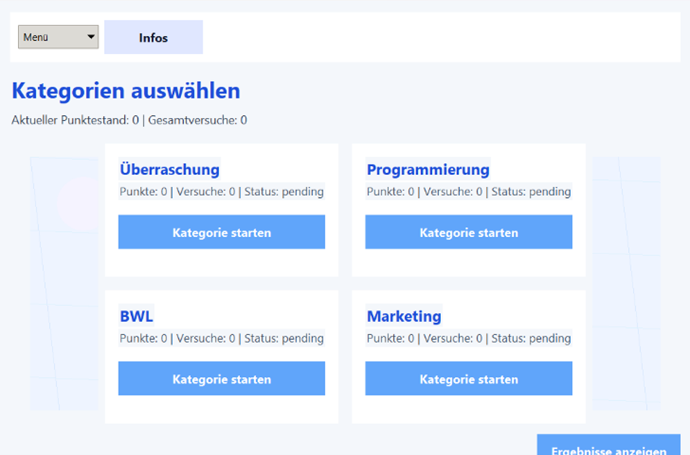
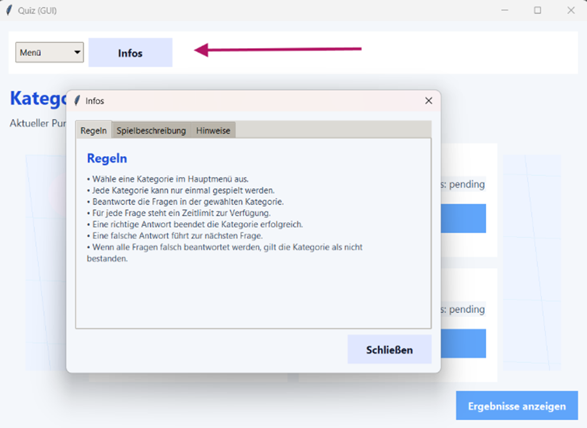
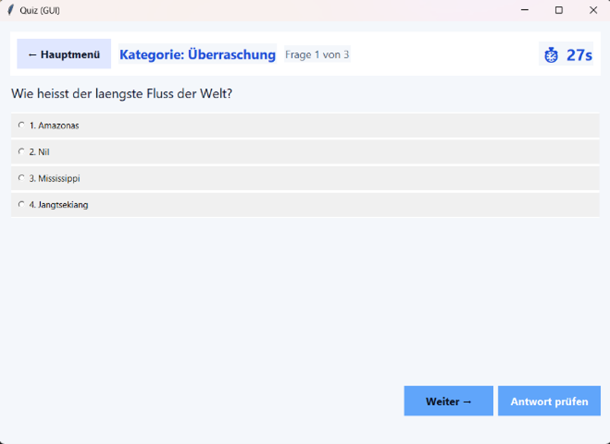
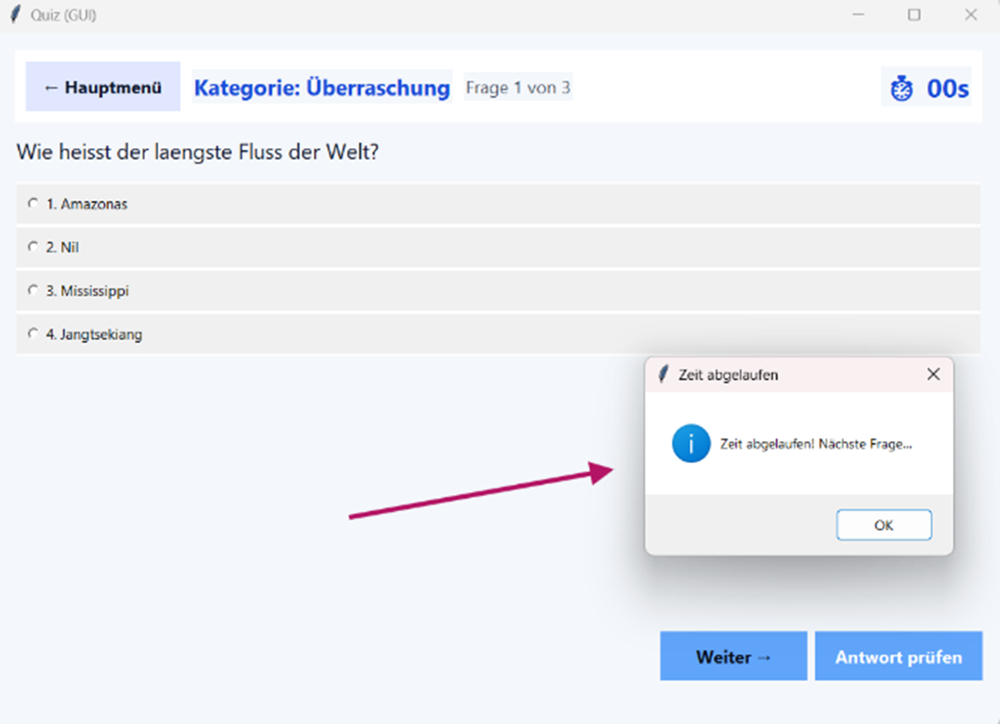
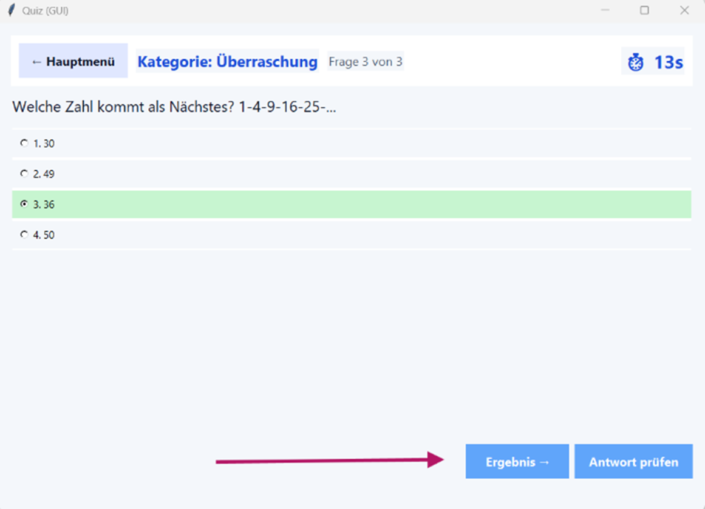
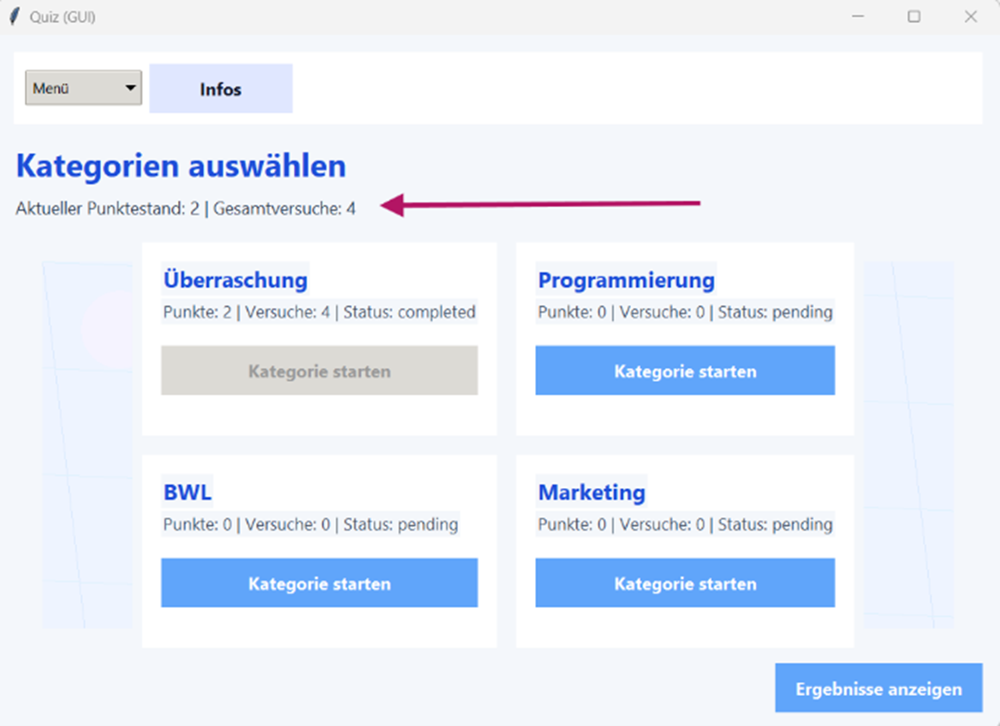
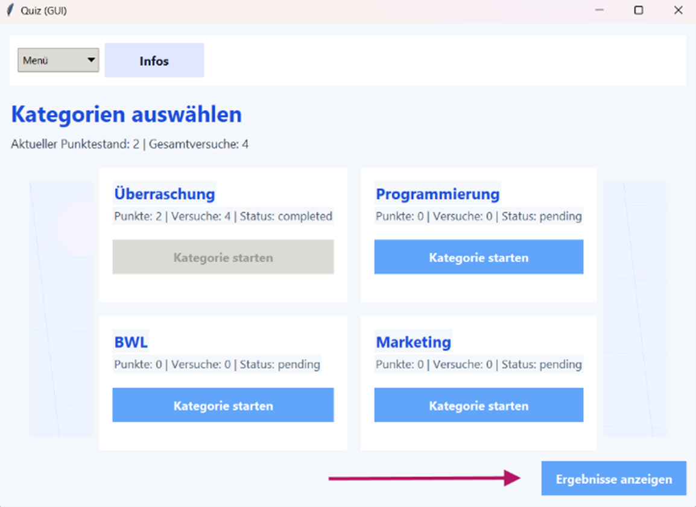
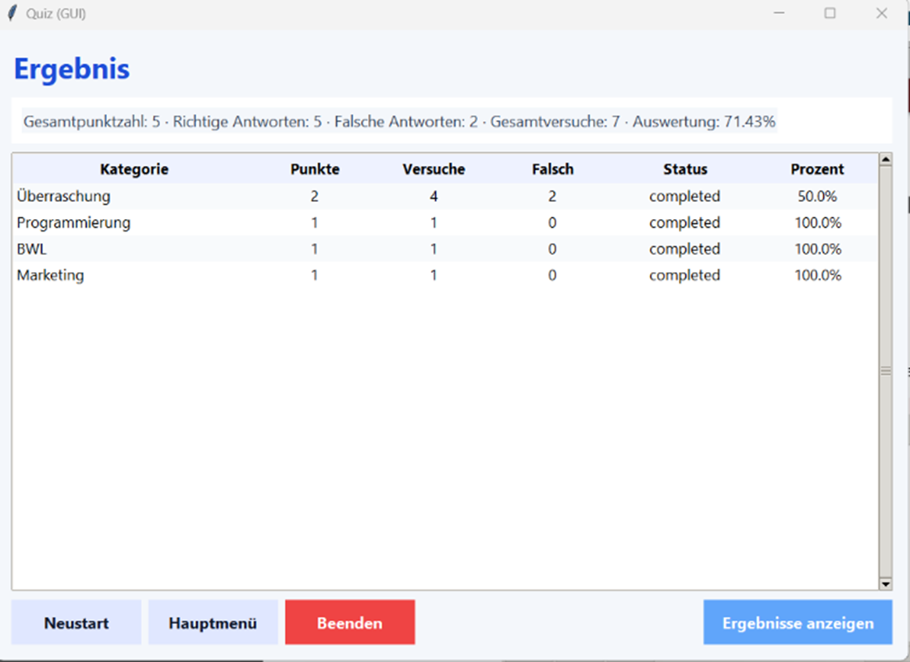

# "Bist du gut vorbereitet?" - das Klausurvorbereitungsquiz


## Inhaltsverzeichnis
- [Projektbeschreibung](#projektbeschreibung)
- [Voraussetzungen und Installation](#voraussetzungen-und-installation)
- [Klassendiagramm](#klassendiagramm)
- [Ausführen](#ausführen-des-quiz)
- [Testen des Programms mit Pytest](#testen-des-programms-mit-pytest)
- [Mitwirkende am Quiz](#mitwirkende-am-quiz)

--------------------------------------------------------------------------------------------------------------------------------------------------------------
   
## 1. Projektbeschreibung: <br>
Ein Quiz, das unseren Kommilitonen helfen soll ihr Modulwissen in wenigen Fragen aufzufrischen. Das Quiz beinhaltet Multiple-Choice-Fragen sowie Rechenaufgaben und eine kleine Spaß-Kategorie mit Fragen, die nichts mit Uni-Inhalten zu tun haben. <br> Das Quiz besteht aus vier Kategorien, die in beliebiger Reihenfolge abgearbeitet werden können. Jede Kategorie enthält maximal drei Fragen. Beantwortet der Nutzer die erste Frage richtig, besteht er die Kategorie. Hat der Benutzer eine Frage falsch beantwortet, hat er noch zwei weitere Versuche mit zwei anderen Fragen, bevor er in der Kategorie durchfällt. Der Punktestand kann während der Bearbeitung des Quiz eingesehen werden, oder nach Bearbeitung der vier Kategorien in Form einer Auswertung. Man kann das Quiz auch während des Versuchs neustarten, wobei alle bisherigen Eingaben des Durchlaufs gelöscht werden. <br>
Hierbei handelt es sich um die Version des Quiz, die um ein Graphical User Interface erweitert wurde. <br>
Unser Projekt wurde mithilfe von GitHub, Visual Studio Code und Pycharm erstellt. Zur Unterstützung unserer Arbeit haben wir die KI-Tools ChatGPT und hauptsächlich Microsoft Copilot verwendet.
 
  
--------------------------------------------------------------------------------------------------------------------------------------------------------------
## 2. Voraussetzungen und Installation <br>
  ### 2.1 Voraussetzungen für das Durchlaufen des Quiz: <br>
  -Python Version 3.13.2  <br>
  -Visual Studion Code (optional, andere IDE möglich) <br>
  -GitHub-Account <br>

   ### 2.2 Installationsanleitung Python 3.13.2: <br>
  Über die offizielle Python Website kann man diese Python installieren und sich einer detaillierten Installationsanleitung unter „downloads“ bedienen.
  [Python Download](https://www.python.org/downloads/)


  ### 2.3 Installationsanleitung Visual Studio Code: <br>
   Über die offizielle VS Code Website kann man diese IDE installieren und sich einer detaillierten Installationsanleitung unter „DOCS“ bedienen. 
   [VS Code Download](https://code.visualstudio.com/docs/)

 
  ### 2.4 Installationsanleitung des Quiz am Beispiel von Visual Studio Code: <br>
   Um das Repository lokal zu klonen, klickt man auf den grünen Code Button in der "Code"-Abteilung von GitHub. Dort kopiert man die URL des Repositories und        öffnet die Visual Studio Code App. Man wählt ganz links das Source-Control-Symbol in der Leiste aus und klickt auf das blaue Feld "Clone Repository". Jetzt
   kann man in die Suchleiste oben in der Mitte der Benutzeroberfläche die URL einfügen und die Projektstruktur sollte links im Explorer auftauchen.

   ### 2.5 Bedienung des feature/gui - branch
   Um sicherzustellen, dass Sie die GUI-Version des Quiz öffnen, können Sie folgende Commands nacheinander in Ihrem Terminal der IDE Ihrer Wahl eingeben, nachdem
   Sie das Repository bereits geklont haben: 
   ```bash
         git checkout feature/gui
	     git pull
   ```


--------------------------------------------------------------------------------------------------------------------------------------------------------------
## 3. Klassendiagramm als UML-Skizze
```bash
@startuml
=========================================================
CATEGORY
=========================================================
class Category {
- name: str
- fragen: List
- score: int
- attempts: int
- failed_attempts: int
- status: str

+ play_category()
}

=========================================================
FRAGE (MULTIPLE CHOICE)
=========================================================
class Frage {
- text: str
- antworten: List[str]
- richtige_antwort: int
- image_path: Optional[str]
+ anzeigen()
+ pruefe_antwort()
+ is_correct()
+ correct_choice_1_based():
+ correct_answer_text()
}
=========================================================
FRAGE OHNE INDEX (OFFENE FRAGE)
=========================================================
class FrageOhneIndex {
- text: str
- richtige_antwort: str
- image_path: Optional[str]

+ stellen()
+ is_correct()
}
=========================================================
QUIZ ENGINE (LOGIK)
=========================================================
class QuizEngine {
- categories: List[Category]

- gesamt_versuche: int
- selected_category: Category
- current_index: int
- versuche_in_runde: int

+ reset_all()
+ category_list()
+ select_category_by_index()
+ current_question()
+ question_progress():
+ submit_answer()
+ summary()
- _handle_correct()
- _handle_incorrect()
}
=========================================================
SUBMIT RESULT (DATA CLASS)
=========================================================
class SubmitResult {
+ correct: bool
+ message: str
+ correct_choice_1_based: Optional[int]
+ correct_text: Optional[str]
+ finished_category: bool
+ category_status: Optional[str]
}
=========================================================
GUI (TKINTER)
=========================================================
class QuizGUI {
- root: Tk
- engine: QuizEngine
- time_limit_seconds: int
- main: Frame
- start_frame: Frame
- quiz_frame: Frame
- result_frame: Frame
- bg_canvas: Canvas
- category_bg_canvas: Canvas
- timer_after_id: int
- remaining: int
+_apply_theme()
+ _on_root_configure()

+_draw_background_pattern()
+_hide_all()
+ show_start(): void
+ show_quiz(): void
+ show_results(): void
+ _build_start_frame(): void
+ _build_quiz_frame(): void
+ _build_result_frame(): void
+ _refresh_start_categories(): void
+ _render_question(): void
+ _render_results(): void

+_on_category_bg_configure()
+ _draw_category_pattern()

+ _submit_current(): void
+ _next_after_feedback(): void
+ _start_timer(seconds: int): void
+ _tick(): void
+ _cancel_timer(): void
+ _on_time_up(): void
+ _mark_mc_feedback(res, q): void
+ _mark_text_feedback(res): void
+ _menu_restart_quiz(): void
+ _menu_new_quiz(): void
+ _menu_quit(): void
+ _open_infos(): void
+ _start_category(idx: int): void
}

}
=========================================================
RELATIONSHIPS
=========================================================
Category "1"--> "*"Frage
Category "1"-->"*"FrageOhneIndex
QuizEngine --> Category

QuizEngine --> SubmitResult
QuizEngine --> QuestionType
QuizGUI --> QuizEngine
QuizGUI --> SubmitResult
build_categories --> Category
@enduml

```


--------------------------------------------------------------------------------------------------------------------------------------------------------------

## 4. Ausführen des Quiz: <br>
   Die Datei main.py muss ausgewählt werden. Anschließend wird der Code durch Klicken auf den „Run“-Button in Ihrer IDE ausgeführt. Das GUI sollte nach wenigen
   Augenblicken erscheinen. Zunächst wird das Hauptmenü angezeigt:
   


   Möchte man das Quiz während der Bearbeitung neu starten oder beenden, kann dies über den „Menu“-Button oben links im Interface erfolgen.
   Weitere Informationen zu den Quizregeln, eine Spielbeschreibung sowie zusätzliche Hinweise können über den „Info“-Button neben dem „Menu“-Button aufgerufen
   werden.
   

   #### Quizbearbeitung
   Mit „Kategorie starten“ kann eine beliebige Kategorie ausgewählt werden, da diese in beliebiger Reihenfolge bearbeitet werden können.
   


   Wird eine Antwort nicht vor Ablauf des Timers eingegeben, wird nach einem Pop-up-Fenster automatisch zur nächsten Frage innerhalb der Kategorie weitergeleitet:
   
   Wird diese Aufgabe ebenfalls falsch beantwortet, erhält man eine weitere Frage innerhalb der Kategorie. Um zu dieser zu gelangen, klickt man auf den Button
   „Next“ unten rechts im Widget.
   
   Jedes Mal, wenn eine Kategorie abgeschlossen wird, verändert sich der Zustand des entsprechenden Feldes, und der Punktestand wird aktualisiert. Möchte man
   während des Quiz den aktuellen Punktestand einsehen, kann man dies über den Button „Ergebnis“ tun. Alternativ ist dieser auch im Hauptmenü verfügbar.
   
   

   Sind alle vier Kategorien abgeschlossen, kann das Gesamtergebnis über das Hauptmenü eingesehen werden, indem man auf den Button „Ergebnisse anzeigen“ unten
   rechts im Widget klickt.
   

   #### Beispielhafte Auswertung
   Eine beispielhafte Auswertung des Quiz könnte folgendermaßen aussehen:
   

   Unten links kann ausgewählt werden, ob man zum Hauptmenü zurückkehren, das Quiz neu starten oder beenden möchte.


--------------------------------------------------------------------------------------------------------------------------------------------------------------
## 5.Testen des Programms mit Pytest:
Falls Sie das Quiz auf Fehler im Code testen möchten, können Sie dies mit Pytest tun.
Wählen Sie eine der Testdateien links in der Explorer-leiste innerhalb des „tests“-Ordners aus. 
Daraufhin gibt man folgenden befehl in Ihrem Terminal ein:
```bash
pytest -v
```


--------------------------------------------------------------------------------------------------------------------------------------------------------------


## 6. Mitwirkende am Quiz: 

Lead Developer: Sarah Friedmann <br>
Testverantwortliche: Tetiana Martyniuk <br>
GUI-Entwicklung: Javeria Mohammad <br>
Präsentationsverantwortliche: Darja Scherbina <br>


